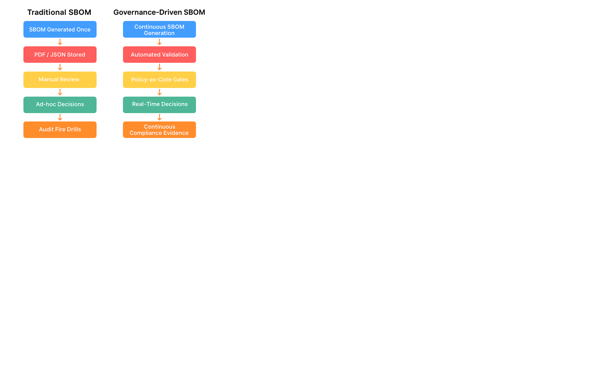

# Lifecycle-Based Model for Automated SBOM Governance in AI

**Author:** Devashri Datta  \
**Affiliation:** OpenSSF SBOM Everywhere SIG (Contributor)  \
**Document Type:** Technical Manuscript  \
**Original Work:** Yes  \
**Date:** January 2026

## Abstract
Software supply‑chain security requires continuous, automated SBOM governance. We present a lifecycle model, a deterministic compliance automaton, a quantitative trust function, and a governance architecture that integrates ingestion, normalization, enrichment, VEX‑aware triage, and policy‑as‑code decisioning. Evaluation using representative scenarios demonstrates improved SBOM completeness, consistency, exploitability triage precision, and audit readiness.

---

## 1. Introduction
Modern software supply chains span cloud‑native systems, AI/ML pipelines, embedded platforms, and third‑party components, creating systemic risk from opaque dependencies. Regulatory frameworks (e.g., EO 14028, NIST SSDF, EU CRA) mandate SBOMs as a foundation for transparency and assurance. Yet most SBOM implementations remain static, incomplete, inconsistent across toolchains, and lack provenance and exploitability context, making them difficult to operationalize as continuous security signals.

This paper introduces a formal lifecycle model for SBOM governance, a deterministic compliance automaton with policy‑as‑code semantics, a quantitative trust function for release authorization, and an end‑to‑end governance architecture. Figure 1 contrasts traditional vs. governance‑driven SBOM workflows.

*Figure 1: Comparison of traditional SBOM workflows versus governance‑driven SBOM workflows.*

---

## 2. System Architecture Overview
The policy‑driven pipeline integrates SBOM generation (CI/CD), ingestion & schema validation, normalization & ID reconciliation, enrichment (licenses, CVEs, VEX, provenance), policy‑as‑code evaluation, decisioning (ship/patch/block/risk acceptance), and evidence storage.

*Figure 2: SBOM governance pipeline showing sources, validation, enrichment, policy gates, decision workflow, and evidence.*

The tooling integration across these stages is summarized below.

*Figure 3: Tools integration architecture across CI/CD, SBOM generation/ingestion, VEX provider, policy engine, and evidence dashboards.*

---

## 3. Lifecycle Semantics and Governance Model
**Lifecycle states:** Produced → Ingested → Normalized → Enriched → Evaluated → Decided → Archived. Transitions are gated by controls (schema validity, signing/provenance verification, VEX coverage, completeness thresholds).

**Deterministic compliance automaton:** A stepwise decision engine that enforces the order of checks and routes exceptions for remediation.

**Governance trust function:** A quantitative score aggregating integrity, completeness, freshness, exploitability context, and provenance to support release authorization.

---

## 4. Maturity Model
We define five capability levels from ad‑hoc SBOMs to predictive, cross‑lifecycle analytics.

*Figure 4: SBOM governance maturity model (L1 to L5).*

---

## 5. End‑to‑End Workflow
The SBOM creation and scanning workflow spans development environments, scanning, triage, inventory, and reporting.

*Figure 5: SBOM creation and scanning workflow from code to analytics.*

---

## 6. Evaluation (Summary)
In representative scenarios, normalization accuracy approached ~99%; VEX integration reduced false positives; SBOM completeness exceeded 95% with freshness ≤48 hours after code changes; continuous evidence packaging reduced audit preparation time.

---

## 7. References (Selected)
- Executive Order 14028; NIST SSDF (SP 800‑218); EU CRA
- CISA Minimum Elements for SBOM; NTIA SBOM resources
- in‑toto, Sigstore/Cosign; VEX/CSAF guidance

